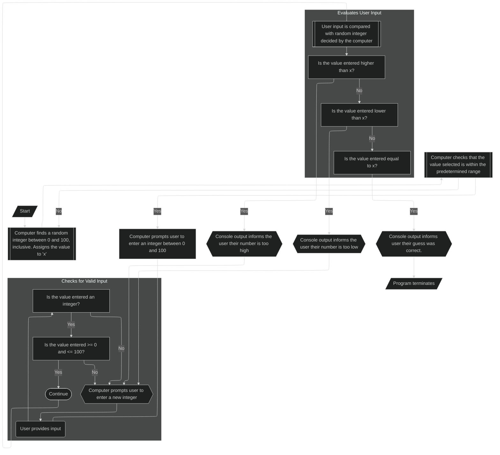

# Summary
##### This is a program where the computer selects a random integer between a specified range, in this example the specified range is between 0 and 100. 
##### The computer will prompt the user to guess integers within that range.
##### Program will end once the user's input is equal to the number selected by the computer.
# Description  
### *Step 1*  
* The computer will select a random number between 0 and 100.
* The program will assign this value to the variable **_x_**

### *Step 2*  
* The user will be prompted to input an integer between the 0 and 100.

### *Step 3*
* The program will evaluate whether or not the user's input was valid.  
  If the input provided by the user is:
  * Not numeric
  * Not within the specified range  
* The program will prompt the user to input a new value and will return to the beginning of **_Step 3_**
* If the input provided by the user is evaluated to be numeric and within the specified range, the program will move on to **_Step 4_**

### *Step 4*  
* In **_Step 4_**, the program will evaluate if the number is higher, lower, or equal to the value selected by the computer at the beginning of the program, which has been stored in the variable **_x_**.
* If the value is higher or lower than **_x_**, there will be a message stating as such, and the program will return to **_Step 3_**, prompting the user to enter a new value.
* If the value is equivalent to the **_x_**, there will be a message stating as such, and the program will terminate.
